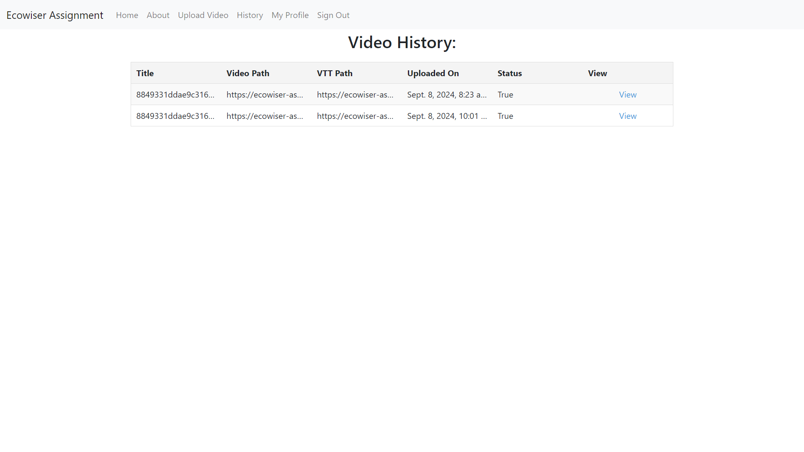

VideoSearch is an innovative platform designed to make your video content easily searchable. By leveraging advanced subtitle extraction and keyword search capabilities, our application allows you to upload videos, process them in the background, and search for specific words or phrases within the video. Whether it’s a music video, a lecture, or any other type of video content, VideoSearch ensures you can quickly find the exact moment where a particular phrase is mentioned.

## How to Use VideoSearch

Upload Your Video: Start by uploading your video file. Our platform supports various video formats.

Background Processing: Once uploaded, our system uses the ccextractor binary to extract subtitles from your video. This process happens seamlessly in the background.

Storage and Indexing: The processed video is stored securely in Amazon S3, and the extracted subtitles are indexed in DynamoDB for efficient searching.

Search with Keywords: Use the search bar to enter any word or phrase. Our application will return the exact time segments within the video where the keywords are mentioned.

Quick Results: Enjoy fast and accurate search results with a maximum latency of approximately 1 second.
Key Features

Subtitle Extraction: Utilizes ccextractor for precise subtitle extraction without relying on external APIs.

Secure Storage: Videos are stored in Amazon S3, ensuring reliability and scalability.

Efficient Search: Keywords are indexed in DynamoDB, providing quick and accurate search results.

Django Backend: Built with Django for robust and scalable backend performance.

Background Tasks: Uses Celery for efficient background processing of video files.

# VideoSearch

## Overview

VideoSearch is a web application that allows users to upload videos and search for specific words or phrases within the video. The application uses the ccextractor binary to extract subtitles from the video and then indexes the subtitles in DynamoDB for efficient searching. The backend is built using Django and Celery for background processing of video files.

## Features

- Upload videos
- Extract subtitles using ccextractor
- Index subtitles in DynamoDB
- Search for specific words or phrases within the video
- Fast and accurate search results

## Installation

1. Clone the repository

## Architecture 

## progresion 

https://app.eraser.io/workspace/vw7Y2vn7jmnBl9nyd5Ex?origin=share

## Demo
https://videoextract.virtualemulators.com/

## ScreenShots

